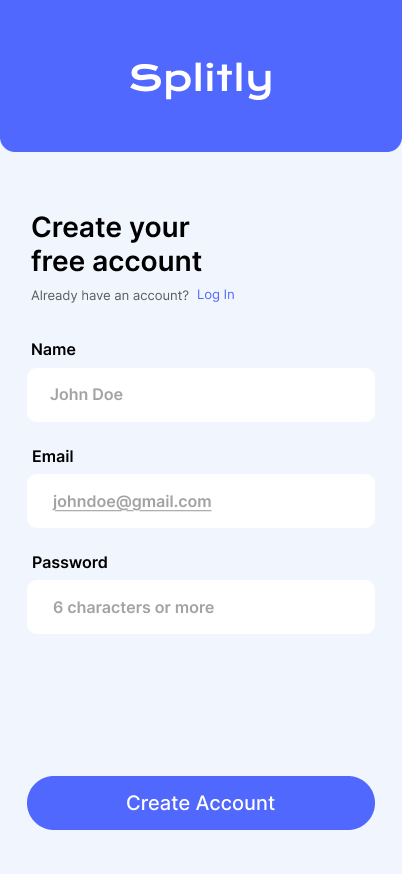
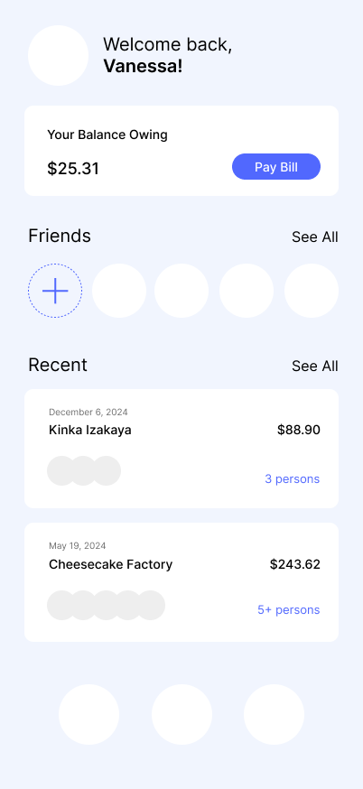
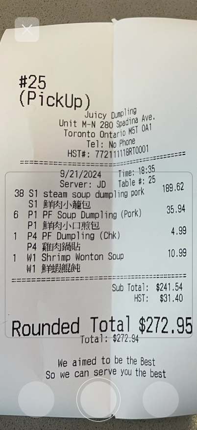
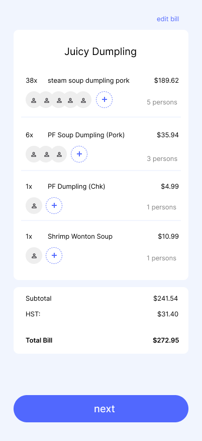
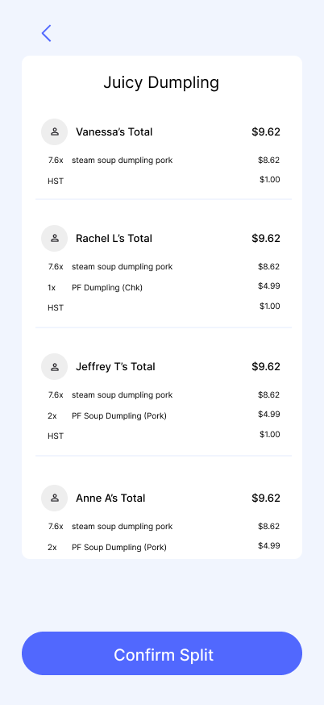

# Project Title

Splitly

## Overview

Splitly simplifies splitting bills among friends or groups. Splitly scans and reads receipts, allowing users to assign expenses to specific individuals efficiently.

### Problem Space

Manually splitting bills with groups after dinners and trips is often tedious or time consuming. It also makes it difficult to keep track of who has paid back.

### User Profile

Individuals or groups that frequently share expenses. (e.g. friends, family, club members, coworkers)

- needing to split a bill for dinner, trips, gatherings
- looking to save time and track payments

### Features

- As a user, I want to be able to create an account
- As a user, I want to be able to login to my account
- As a logged in user, I want to scan or upload a receipt that can extract and display the itemized bill.
- As a logged in user, I want to assign items on the bill to specific individuals so the app can calculate individual shares.
- As a logged in user, I want to view the calculated distribution among participating individuals
- As a logged in user, I want to see past bills
- As a logged in user, I want to see my balance owing

## Implementation

### Tech Stack

- React
- Express
- MySQL
  Client libraries
- React
- react-router
- axios
  Server libraries
- knex
- Express
- bycrypt

### APIs

Taggun - OCR AI scanner for receipts
MediaStream - camera access API

### Sitemap

- Create account
- Login
- Home page
- Receipt Scanner/Uploader
- Itemized Bill + assign users
- View Bill Split among users
- Success screen

### Mockups

#### Create Account Page

#### Login Page

#### Home Page

#### Scanner Page

#### Itemized Bill Page

#### View Split Page

#### Success Page

### Data

### Endpoints

\*\*POST /user/register

- add a user account
  Parameters:
- name: The user's name
- email: The user's email
- password: The user's provided password
  Response:
  {
  "name": "John Doe",
  "email": "johndoe@gmail.com",
  "password": "password123"
  }

\*\*POST /user/login

- login to user account
  Parameters:
- email: The user's email
- password: The user's provided password
  {
  "email": "johndoe@gmail.com",
  "password": "password123"
  }

\*\*POST /receipts

- upload receipt
  Parameters:
- image: The receipt image

\*\*GET /receipts/:receipt_id

- get receipt details
  Parameters:
- receipt id: The receipt id
  {
  "receipt_id": "123",
  "items":
  [
  {item_id:1, "name": "Dumpling, "price": 8.99},
  {item_id:2, "name": "Soup", "price": 4.49}
  ]
  "total": 15.00,
  "tax": 1.00,
  "tip": 2.00,
  }

\*\*POST /items/:item_id/assign

- assign item to friends
  Parameters:
- item id: The item id
- friends id: your friends id
  {
  "friends_ids": [1,2],
  "split":
  }

\*\*POST /calculations

- calculate bills
  Parameters:
- receipt id: The receipt id
- split: The split between friends
- tax: tax from receipt
- tip: tip from receipt

\*\*POST /friends

- add friend
  Parameters:
- name: name of friend
- email: email of friend
  {
  "name": "John Doe",
  "email": "johndoe@gmail.com",
  }

\*\*POST /friends

- list friends
  Parameters:
- name: name of friend
  {
  "name": "John Doe",
  }

## Roadmap

- Create Client

- Create Server

- Create Migrations

- Feature: Create Account

- Feature: login

- Feature: Home Page

- Feature: Receipt Scanner

- Feature: Itemized Bill

- Feature: Split Bill

- Feature: Success Page

- Bug fixes

- DEMO DAY

## Future Implementations

- store currency
- Ability to transfer funds to friends
- attatch own cards
- interactive with other users & profiles
- notifications from bill spilts
