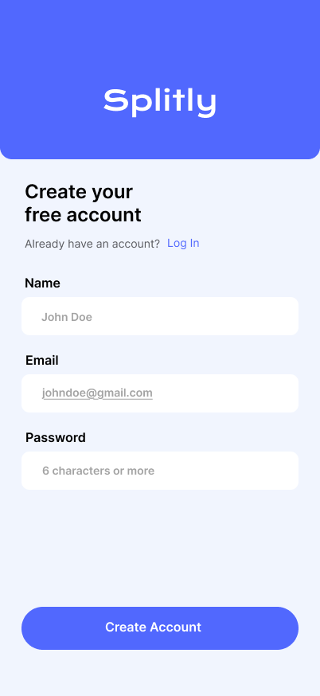
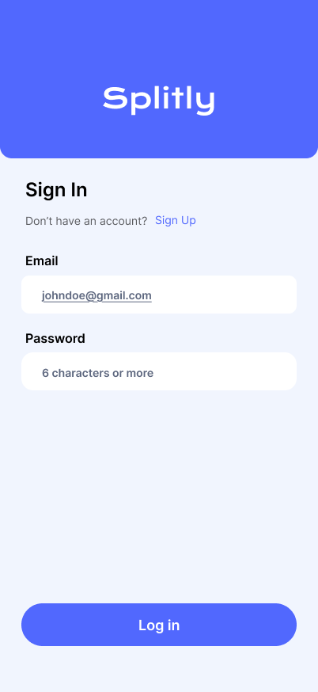
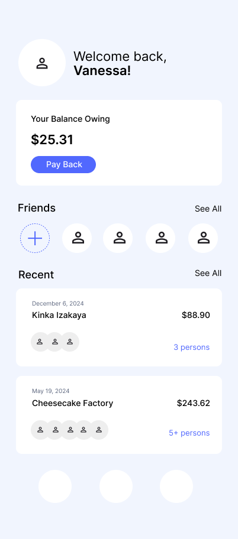
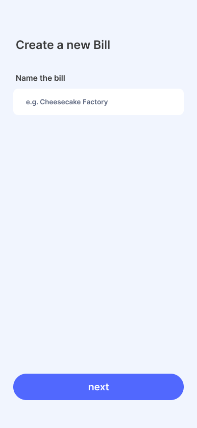
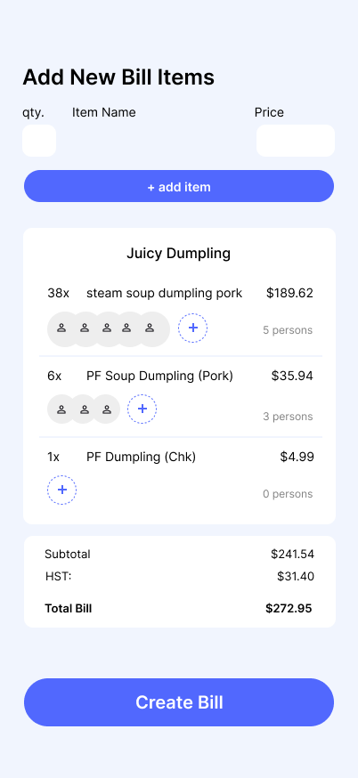
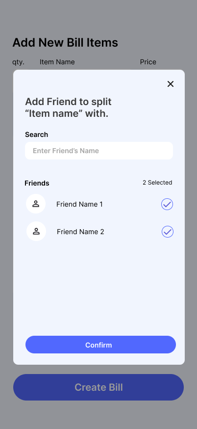
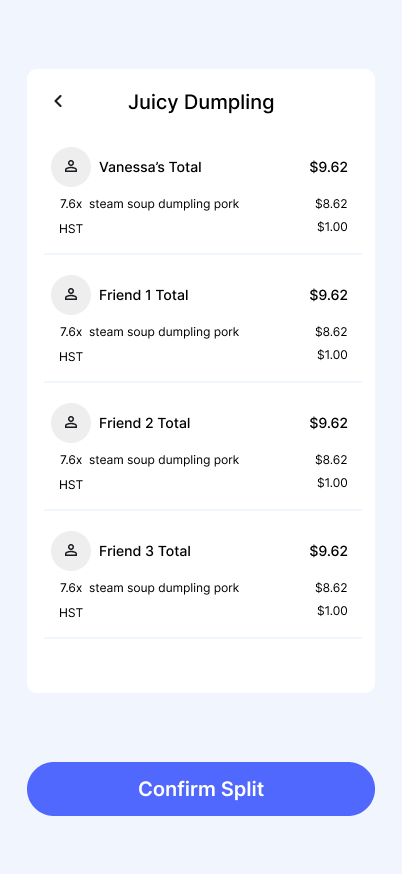
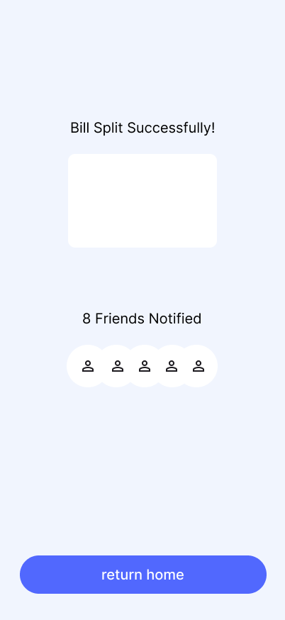
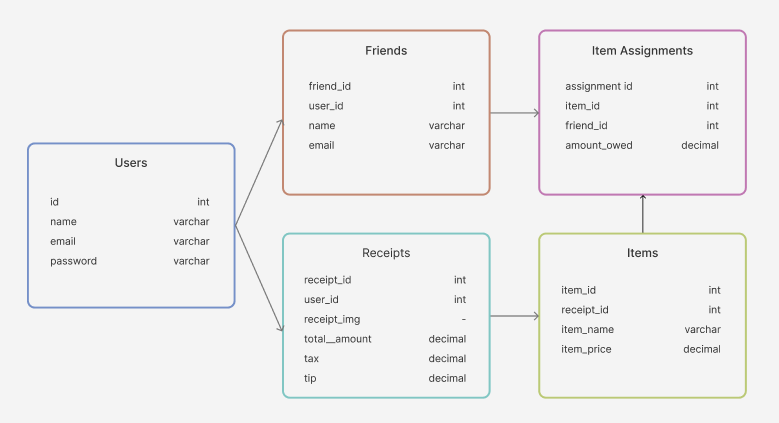

# Project Title

Splitly

## Overview

Splitly simplifies splitting bills among friends or groups and allows users to assign expenses to specific individuals efficiently.

### Problem Space

Splitting bills with groups after dinners and trips is often tedious or time consuming. It also makes it difficult to keep track of who has paid back.

### User Profile

Individuals or groups that frequently share expenses. (e.g. friends, family, club members, coworkers)

- needing to split a bill for dinner, trips, gatherings
- looking to track payments

### Features

- As a user, I want to scan or upload a receipt that can extract and display the itemized bill.
- As a user, I want to assign items on the bill to specific individuals so the app can calculate individual shares.
- As a user, I want to view the calculated distribution among participating individuals
- As a user, I want to see past bills
- As a user, I want to see my balance owing

## Implementation

### Tech Stack

- React
- Express
- MySQL
- react-router
- axios
- knex

### Sitemap

- Create account
- Login
- Home page
- Receipt Manual Input
- View Bill Split among users
- Success screen

### Mockups

#### Create Account Page

#### Login Page

#### Home Page

#### Create Bill Page

#### Add Bill Items Page

#### Select Friends Page

#### View Split Page

#### Success Page

### Data

### Endpoints

\*\*POST /bills

- create a new bill with a name
  Parameters:
- bill name: The name of the bill
  Response:
  {
  "bill_id": 1,
  }

\*\*GET /bills/:billId

- Gets data associated with specific bill
  Parameters:
- bill id: id for the bill
  Response:
  {
  "bill_id": 1,
  "user_name": "Chipotle,
  "tax": null,
  "tip": null,
  "item_id": 5, 
  "item_name": "Veggie Bowl",
  "qty": 3,
  "item_price": 16.99,  
  "friend_id": 5, 
  "friend_name": 5, 
  "friend_photo": 5, 
  }

  \*\*GET /bills/:billId/splits

- Calculates and gets bill split summary among friends
  Parameters:
- bill id: id for the bill

\*\*POST /cost_distribution

- adds friends to split specific item
  Parameters:
- item id: id of item
- friends: friend ids
  Response:
  {
  "item_id": 1,
  "Friends": [1,2,3]
  }

\*\*GET /cost_distribution/:item_id

- get friends part of split of item
  Parameters:
- item id: id of item that is split

\*\*POST /items

- adds items to specific bill
  Parameters:
- bill id: id of bill
- qty: quantity of item
- item name: name of item
- price: price of item
  Response:
  {
  "item_id": 1,
  "bill_id": 2,
  "item_name": "Veggie Bowl",
  "qty": 2,
  "item_price": 32.99,
  } 

\*\*GET /users

- gets users from database
  Response:
  {
  "id": 1,
  "name": "John Doe",
  "photo": "/imagepath"
  }

## Roadmap

- Create Client

- Create Server

- Create Migrations

- Feature: Home Page

- Feature: Create Bill

- Feature: Add Items to Bill

- Feature: Itemized Bill

- Feature: Split Bill

- Feature: Success Page

- Bug fixes

- DEMO DAY

## Future Implementations
- API scanner to read receipts
- Functional Sign Up/Sign In
- Home Page loads non-static data
- Home Page fully functional
- Functions to Edit and Delete
- interactive with other users & profiles
- notifications from bill spilts
